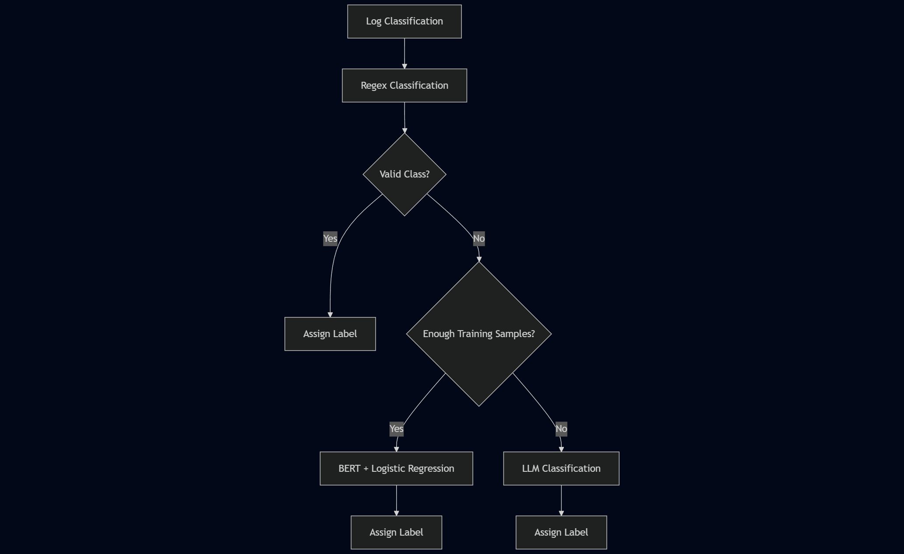

# Log Classification with Hybrid Framework

This project presents a **hybrid log classification system** designed to handle real-world, large-scale log data with varying complexities. By integrating **Regex**, **BERT-based models**, and **LLMs**, the framework achieves flexible, robust, and accurate classification.

---

## Problem Statement

Log messages vary in structure and complexity. Traditional models fail when:
- Patterns are too rigid or dynamic
- Labeled data is sparse
- Complex semantic understanding is required

**Our hybrid system dynamically chooses the right tool for each type of pattern.**
## 🧠 Classification Strategy

## ⚙️ Hybrid Components

### ✅ 1. **Regex-Based Classification**
- Best suited for **predictable** patterns
- Rule-based and lightweight
- Classifies simple logs immediately

### ✅ 2. **BERT + Logistic Regression**
- For **complex logs** with **sufficient training data**
- Uses **SentenceTransformer** for embeddings
- Clusters logs using **DBSCAN**
- Applies **Logistic Regression** to assign labels

### ✅ 3. **LLM (Large Language Model)**
- Used when **training data is insufficient**
- Provides generalization for complex, rare log entries
- Fallback for hard-to-classify logs

---
****Folder Structure**

**training/:****
Contains the code for training models using Sentence Transformer and Logistic Regression.
Includes the code for regex-based classification.

**models/:**
Stores the saved models, including Sentence Transformer embeddings and the Logistic Regression model.

**resources/:**
This folder contains resource files such as test CSV files, output files, images, etc.

**Root Directory:**
Contains the FastAPI server code (server.py).

**Setup Instructions**
Install Dependencies: Make sure you have Python installed on your system. Install the required Python libraries by running the following command:

pip install -r requirements.txt

**Run the FastAPI Server: To start the server, use the following command:**
uvicorn server:app --reload

Once the server is running, you can access the API at:

**Usage**
Upload a CSV file containing logs to the FastAPI endpoint for classification. Ensure the file has the following columns:

source
log_message
The output will be a CSV file with an additional column target_label, which represents the classified label for each log entry.
